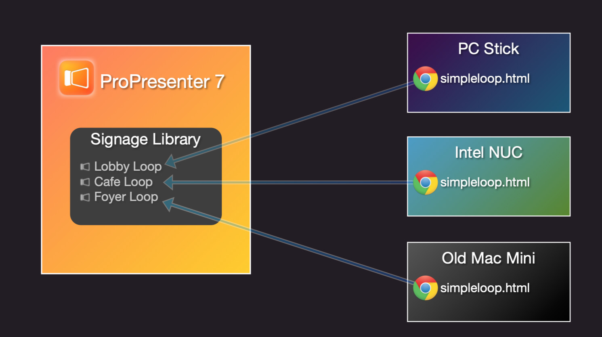

# Pro7SimplePresentationLoop
A crude and simple "digital signage" **experiment** for Pro7 all contained in a single simpleloop.html.
The idea is to that you can copy the `simpleloop.html` file to a spare (small) computer and edit it to connect to your Pro7 setup and display an image slide show of a specific presentation.



This simple web page will connect to Pro7, via new API in 7.9+, and it will download slide images of the all slides for a specified presentation and then roll through a looping display of those slide images.  It does not support anything more than that! No video, no animations - just a slideshow of disolving images. Hopefully this is lightweight enough to run on little PC sticks and Raspberry Pi's.

It's just another fun experiment with the new Pro7 API.


## Setup Instructions:
1. Copy simpleloop.html to a computer (on same network as Pro7).
2. Open simpleloop.html in your fav text eidtor and update the following values in the script code to suit your setup:
```
/*********** UPDATE THESE TO SUIT YOUR PRO7 SETUP *********************/
var ipAddressOfProPresenterComputer = "192.168.1.7"; // Hostname can used used here also if you have hostname resolution for your ProPresenter computer
var networkPortOfProPresenter = "50001"; // See ProPresenter network prefences
var libraryName = "Signage"; // Name of library with presentations to be used as simple digital signage
var presentationName = "Lobby Loop"; // Name of presenation (within library above) to run as simple slide show
var slideQuality = "1920"; // Width of image in pixels
var slideTime = 3; // Number of seconds to show each slide.
var transitionTime = 0.5; // Number of seconds to dissolve between each slide
var refeshPollTime = 10;  // Number of seconds to wait before polling the presentation to check if it has any changes! (be careful not to impact the performance of your pro7 machine by polling the presentation too often!)
/**********************************************************************/
```
3. Optionally, update the initial background image url (example image included in source to demo using a local file - you can of course use online files)
```
background-image: url("./church-logo.jpg");
```
4. Setup the computer to open this file in a web-browser, full-screen at startup.

I have aimed to make sure that it will download the images once and cache them until the webpage is reloaded (or the presentation changes)

TODO: Explore and perhaps make it robust!
